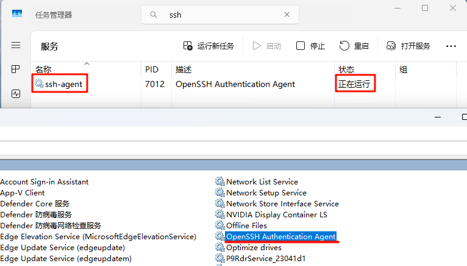
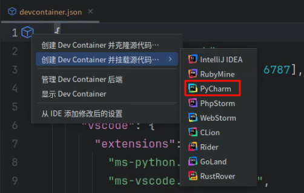
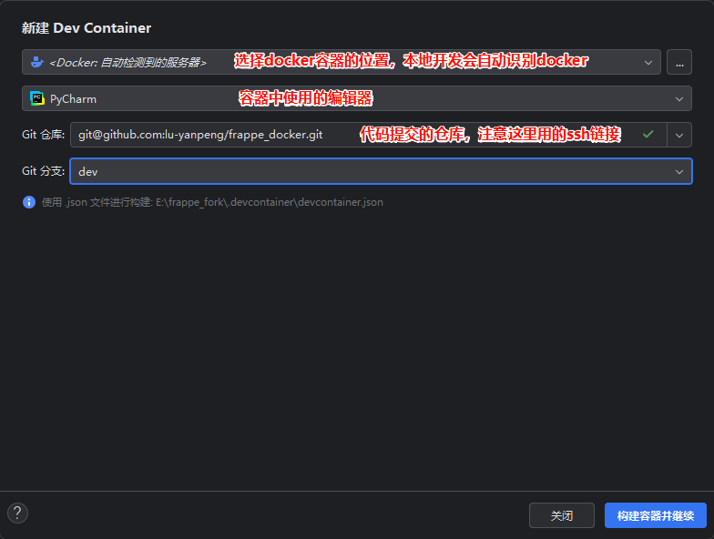
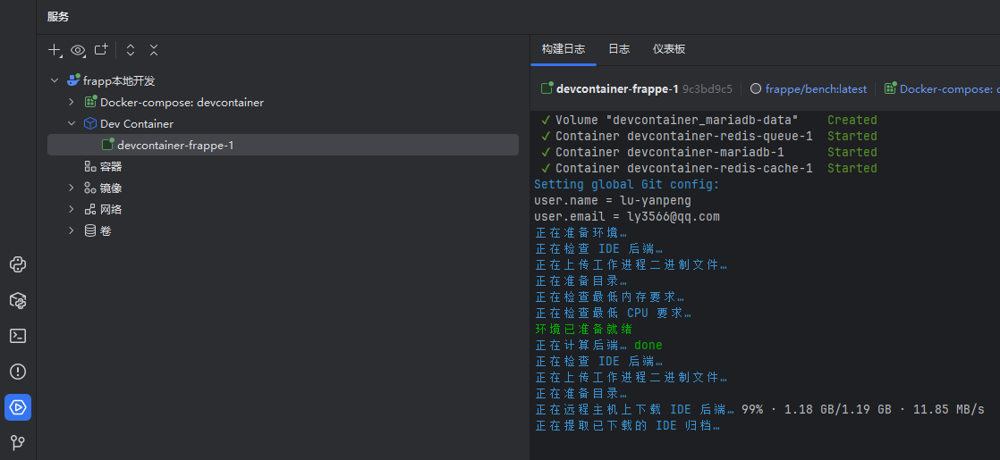
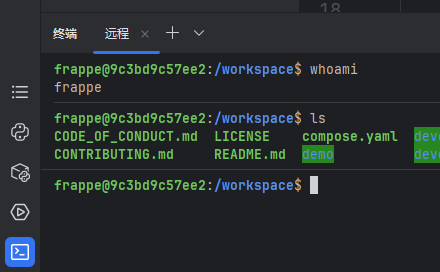
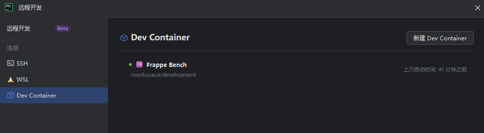
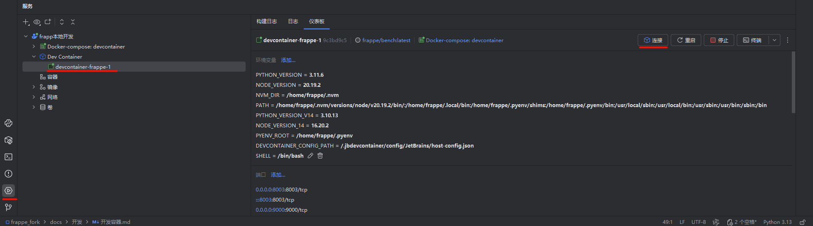

# 创建开发容器

> 参考pycharm官方的[教程](https://www.jetbrains.com/help/pycharm/2025.1/dev-containers-starting-page.html)，容器开发可以在本地的docker中，
> 也可以远程连接到云服务，但是windows远程连接linux会遇到很麻烦的系统路径问题，暂时没法解决，只演示本地docker开发

这里基于windows11和PyCharm 2025.1.3.1专业版进行演示

## 添加SSH

先确定系统有没有安装ssh，IDE需要用ssh在容器中提交代码

打开任务管理器，在侧边栏最后一项的服务中搜索ssh，确认他在运行中。如果没有运行并且也启动不了，可以右键选中打开服务，找到并
开启OpenSSH，这时候应该就能启动ssh-agent了



运行这个命令添加ssh key

```shell
# 密钥一般保存在下面这个目录
ssh-add C:\Users\11022\.ssh\id_ed25519
# 查看已添加的密钥
ssh-add -l
```

配置代理，编辑`C:\Users\11022\.ssh\config`，没有的话就创建，添加下面内容

```txt
# 针对 GitHub.com
Host github.com
  Hostname ssh.github.com
  Port 443
  User git
  IdentityFile C:\Users\11022\.ssh\id_ed25519  # 替换为您的密钥文件
  ForwardAgent yes
```

从frappe/bench镜像的构建步骤可以看到，这个config文件会容器复制到`/home/frappe`目录下使用，不配置的话创建好容器后进入容器手动配置也行。

## 创建容器

创建开发容器有多种方式，这里直接打开根目录`.devcontainer/devcontainer.json`，点击第一行左边的小方块就可以创建容器了。
`.devcontainer`文件夹是从`devcontainer-example`复制来的，修改了名字方便编辑器识别



前面两个选项都是创建容器的，推荐第一种方式创建，就是把代码全部放到容器，在容器里提交代码，容器修改不会影响本地代码，
除非手动用compose的volumes绑定本地代码。

第二种方式会挂载本地的代码，容器里面修改后会同步修改本地的代码，这样电脑性能不够会很卡。

点击`创建Dev container并克隆源代码`在弹出的对话框里填写docker的位置，本地开发会自动识别，如果是远程开发就需要用ssh连接到服务器。远程连接可以看官方的
[教程](https://www.jetbrains.com/help/pycharm/2025.1/start-dev-container-for-a-remote-project.html)

git仓库那里一定要用ssh链接，否则会报错，记得提前在github上配置好ssh密钥



点击创建后弹出服务窗口，等待容器创建完成，每次创建都会自动下载一个新的pycharm用于容器内开发



全部完成会自动打开一个新的IDE，这个IDE安装在容器里，这样所有环境已经准备好可以开发了。通过新IDE的终端可以看到现在处在容器环境中



## 打开容器

要打开一个创建好的容器，点击左上角 主菜单 -> 文件 -> 远程开发 -> Dev Container，选择要连接的容器就行了。在欢迎界面也可以选择远程开发



## 管理容器

在IDE左下角有个服务按钮，点击后可以管理已经创建的容器，或者按Alt+8也可以打开服务，可以在这里删除容器或镜像。相当于一个简易的docker desktop


